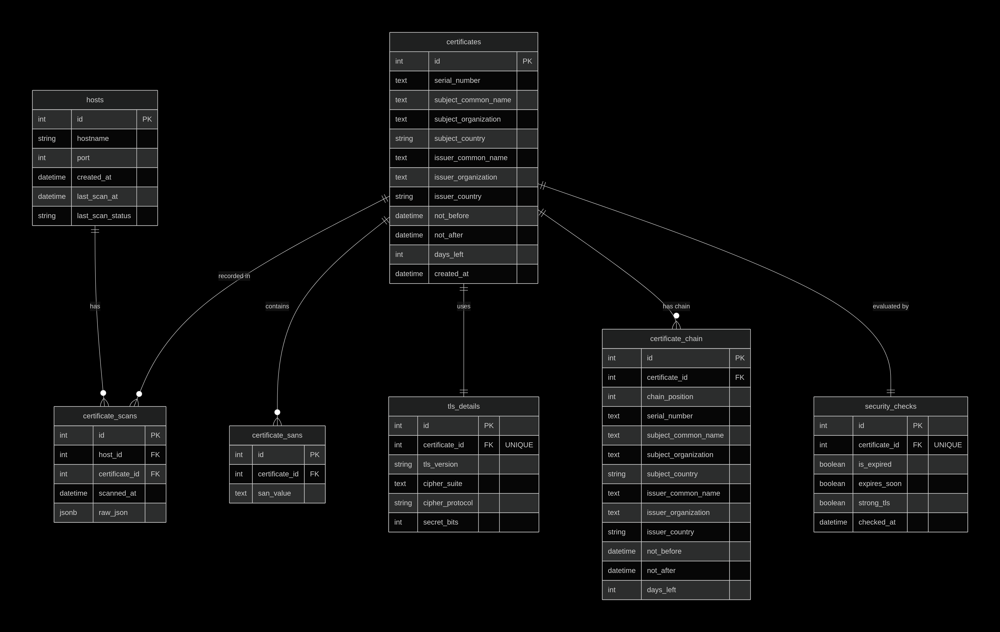

# SSL Certificate Monitoring System

FastAPI-powered backend service for scanning, monitoring, and managing SSL certificates. This application provides detailed insights into certificate chains, TLS versions, cipher suites, and security health for target domains.

## 🚀 Key Features

- **Automated Certificate Scanning**: Fetch real-time certificate information from any URL.
- **Intelligent Caching**: Avoid redundant network overhead by serving valid cached data based on configurable TTL.
- **Historical Scan Tracking**: Maintain a complete history of scans for every monitored host.
- **Security Analysis**: Automatic checks for expiration, weak TLS configurations, and upcoming renewals.
- **Detailed TLS Insights**: Extract cipher suites, TLS protocols, and certificate chain details.
- **Efficient Pagination**: Optimized retrieval of large datasets using a repository pattern.

## 📊 Database Schema

Below is the Entity Relationship Diagram (ERD) of the system:



## 🏗️ Architecture & Design Choices

### 1. Repository Pattern (`query_repo.py`)

We implemented a centralized `QueryRepository` to encapsulate all SQLAlchemy query logic.

- **Reason**: This separates data access from business logic, ensuring that the services remain clean and focused on workflow orchestration. It also makes it easier to optimize complex joins and subqueries in one place.

### 2. Service Layer Decoupling (`services/`)

Business logic is divided into specialized services (`certificate_service`, `host_service`).

- **Reason**: Decoupling the API layer from the business logic allows for better reusability. For example, a background task could use the same service logic as an API endpoint without code duplication.

### 3. Normalized Database Schema

The database uses a highly normalized structure with distinct tables for `Host`, `Certificate`, `CertificateScan`, `TLSDetail`, and `CertificateChain`.

- **Reason**:
  - **Normalization**: Prevents data redundancy (e.g., multiple hosts sharing the same certificate).
  - **Many-to-Many Relationship**: Handled via the `CertificateScan` table, allowing us to track which host had which certificate at a specific point in time.
  - **Performance**: Smaller, specialized tables improve query performance and data integrity.

### 4. Smart Caching Strategy

Before performing a network-heavy SSL scan, the system checks the `last_scan_at` timestamp.

- **Refresh Choice**: We have chosen a **24-hour TTL (Time-To-Live)** for stale entries.
- **Reasoning**:
  - SSL certificates typically have long validity periods (months/years), so scanning more frequently than once a day is often unnecessary and wasteful for both the client and the target server.
  - 24 hours provides a good balance between data freshness (catching certificates that might have been renewed overnight) and system performance.
  - Users can always bypass this via the `/check_no_cache` endpoint if an immediate update is required.

### 5. Pydantic for Data Integrity (`schema/`)

Strict API contracts are enforced using Pydantic models.

- **Reason**: This ensures that all incoming requests and outgoing responses are validated, providing a "fail-fast" mechanism and clear documentation for API consumers.

## 📂 Project Structure

```text
├── app/
│   ├── api/          # FastAPI Route Handlers
│   ├── core/         # Database configuration and core settings
│   ├── models/       # SQLAlchemy ORM Models
│   ├── schema/       # Pydantic Validation Schemas
│   ├── services/     # Business logic and orchestration
│   ├── utils/        # Certificate parsing and helper functions
│   ├── query_repo.py # Centralized data access layer
│   └── main.py       # Application entry point
├── alembic/          # Database migration scripts
├── scripts/          # Automation and utility scripts
├── Dockerfile        # Containerization configuration
└── docker-compose.yml# Multi-container orchestration (App + PostgreSQL)
```

## 🛠️ Tech Stack

- **Framework**: [FastAPI](https://fastapi.tiangolo.com/)
- **ORM**: [SQLAlchemy](https://www.sqlalchemy.org/)
- **Validation**: [Pydantic v2](https://docs.pydantic.dev/)
- **Database**: [PostgreSQL](https://www.postgresql.org/)
- **Migrations**: [Alembic](https://alembic.sqlalchemy.org/)
- **Tooling**: [Docker](https://www.docker.com/), [OpenSSL](https://www.openssl.org/) (for cert extraction)

## 🚦 Getting Started

### Using Docker (Recommended)

1. Clone the repository.
2. Build and run:
   ```bash
   docker-compose up --build
   ```
3. Access the API at `http://localhost:8000`.
4. Interactive Docs: `http://localhost:8000/docs`.

### Local Setup

1. Install dependencies:
   ```bash
   pip install -r requirements.txt
   ```
2. Configure `.env` with your database credentials.
3. Run migrations:
   ```bash
   alembic upgrade head
   ```
4. Start the server:
   ```bash
   uvicorn app.main:app --reload
   ```

## 📖 API Overview

- `POST /certificates/check`: Scan or fetch cached certificate for a URL.
- `POST /certificates/check_no_cache`: Force a fresh scan.
- `GET /certificates/`: List all scanned domains with latest status.
- `GET /certificates/{hostname}`: Get all certificates associated with a host.
- `GET /certificates/{hostname}/tls`: Get detailed TLS/Cipher information.
- `DELETE /certificates/{hostname}`: Remove a domain and its scan data.

## 🤝 Handover Notes

If you are new to this project, here is how the data flows:

1. **API Layer (`app/api/`)**: Endpoints receive requests, validate them using Pydantic schemas, and pass them to the appropriate service.
2. **Service Layer (`app/services/`)**: Orchestrates business logic.
   - `certificate_service` handles the core scanning logic, cache validation, and mapping network data to models.
   - `host_service` handles host management, pagination, and cleanup.
3. **Repository Layer (`app/query_repo.py`)**: All database read operations are centralized here to keep the services focused on logic rather than query building.
4. **Data Layer (`app/models/`)**: SQLAlchemy models define the database structure. We use a normalized approach to track scans over time while avoiding certificate duplication.

### Key Workflows:

- **Checking a Certificate**: `api` -> `certificate_service.get_or_create_certificate` -> check `query_repo` for cache -> if stale/missing, perform network scan -> save via `db.add` -> return response.
- **Deleting a Host**: `api` -> `host_service.delete_host_and_orphans` -> delete host -> find orphan certificates (not linked to other scans) -> delete orphans.
